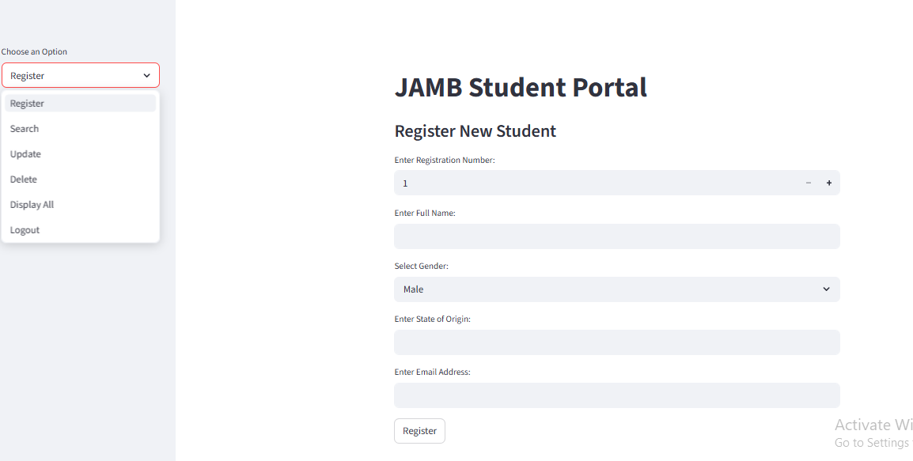

# 🎓 JAMB Student Portal

A web-based **Student Information Management System** built with **Python, Streamlit, SQLite, and Pandas** for registering, searching, updating, deleting, and managing student records through an intuitive interactive dashboard.

This project demonstrates the implementation of **CRUD (Create, Read, Update, Delete) database operations**, relational database management, and interactive web application development using Python.

---

# 🌐 Live Application

🔗 https://k-jamb-app.streamlit.app/

---

# 📌 Project Overview

Educational institutions require efficient systems for managing student records and reducing manual administrative processes.

The **JAMB Student Portal** was developed as a lightweight student management system that enables administrators to manage student information through a simple web interface backed by an SQLite database.

The application allows users to:

- Register new students
- Search student records
- Update student information
- Delete existing records
- Display all registered students

This project demonstrates practical database management and interactive web application development using Python.

---

# 🎯 Problem → Solution → Impact

## Problem

Managing student records manually is time-consuming, error-prone, and inefficient. Educational institutions require reliable digital systems for storing and retrieving student information.

## Solution

This application integrates **Streamlit, SQLite, and Pandas** into a simple yet effective Student Information Management System that supports complete CRUD operations through an intuitive web interface.

## Impact

The system demonstrates how modern web technologies can support:

- Student registration
- Academic record management
- Educational administration
- Digital data management
- Database-driven applications

---

# 🚀 Key Features

## 📝 Student Registration

Register new students using:

- Registration Number
- Full Name
- Gender
- State of Origin
- Email Address

---

## 🔍 Student Search

Retrieve student records instantly using the registration number.

---

## ✏️ Update Student Records

Modify existing student information directly from the dashboard.

---

## 🗑️ Delete Student Records

Remove records safely from the database.

---

## 📊 Display All Students

View all registered students in an interactive table powered by Pandas.

---

## 💾 SQLite Database Integration

Uses **SQLite** for persistent and efficient data storage.

---

## ⚡ Interactive Streamlit Dashboard

Provides a clean, responsive, and user-friendly interface for managing student information.

---

# 📸 Application Screenshot

## 🖥️ Dashboard



---

# 📍 Dashboard Overview

The **JAMB Student Portal Dashboard** provides a centralized interface for managing student records through interactive forms and database operations.

---

## 🎛️ Sidebar Navigation

The sidebar allows users to navigate between:

- Register Student
- Search Student
- Update Student Information
- Delete Student Record
- Display All Records
- Logout

This navigation structure makes the application simple and intuitive.

---

## 🔍 Student Search Module

The Search Module allows users to retrieve student information by entering a registration number.

When a valid registration number is entered, the system displays:

- Registration Number
- Student Name
- Gender
- State of Origin
- Email Address

If no matching record exists, the application displays an appropriate notification.

---

## 💾 Database Operations

The application uses **SQLite** as its backend database.

When a search is performed:

- A SQL query is executed
- The database searches for the registration number
- Matching records are returned and displayed

Example SQL query:

```sql
SELECT * FROM informations
WHERE reg_no = ?;
```

---

## 📊 Interactive Data Display

Student information is displayed using Pandas DataFrames, providing:

- Clean formatting
- Easy readability
- Interactive data exploration

---

# 🏗️ System Architecture

```text
User Interface (Streamlit)
          │
          ▼
Student Forms
(Register / Search / Update / Delete)
          │
          ▼
Input Validation
          │
          ▼
SQLite Database
(Create • Read • Update • Delete)
          │
          ▼
Pandas Data Processing
          │
          ▼
Interactive Dashboard
          │
          ▼
Student Information Management
```

---

# 🛠️ Technology Stack

## Programming

- Python

## Web Framework

- Streamlit

## Database

- SQLite3

## Data Processing

- Pandas

---

# 📂 Project Structure

```text
JAMB-Portal/
│── assets/
│   └── Dashboard.png
│── Portal.py
│── students.db
│── requirements.txt
│── README.md
```

---

# ⚙️ Installation

## Clone Repository

```bash
git clone https://github.com/kola56de/JAMB-Portal.git

cd JAMB-Portal
```

---

## Install Dependencies

```bash
pip install -r requirements.txt
```

---

## Run the Application

```bash
streamlit run Portal.py
```

---

# 🎯 Applications

- Student Information Management Systems
- Educational Administration
- School Registration Systems
- CRUD Database Applications
- Database Management Projects
- Python Web Applications
- Administrative Information Systems

---

# 📈 Future Roadmap

- User Authentication and Authorization
- Admin Dashboard
- Student Result Management
- Cloud Database Integration
- Email Notifications
- PDF Report Generation
- Student Transcript Management
- Multi-User Support
- REST API Integration

---

# 👨‍💻 Author

## **Engr. Dr. Kolade Olonisakin, FNSE**

**Civil Engineer | Data Scientist | Machine Learning Engineer | AI Engineer | Transportation & GIS Analytics**

🌍 **Portfolio**

https://olonisakin-emmanuel.github.io/OlonisakinEmmanuel.github.io/

💼 **LinkedIn**

https://www.linkedin.com/in/engr-dr-kolade-olonisakin-fnse/

💻 **GitHub**

https://github.com/kola56de

---

# ⭐ Support

If you found this project useful, please consider giving it a **⭐ Star** on GitHub.

Feedback, suggestions, and collaboration opportunities are always welcome.
